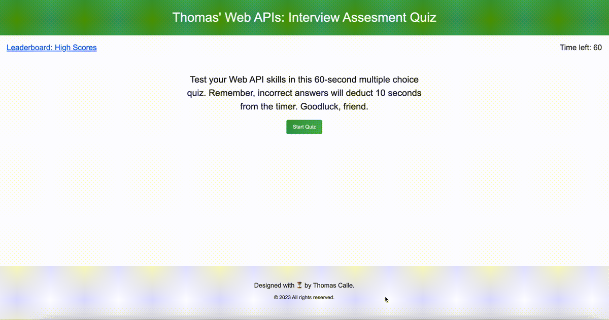

# Thomas' Web APIs: Interview Assesment Quiz

[](https://opensource.org/licenses/MIT)

## Description

Thomas' Web APIs: Interview Assesment Quiz

The purpose of the module named "JavaScript Interview Assessment" is to asses fellow Full Stack Developers or to challenge newly focused JavaScript users by taking a 'Moderate' level interview assesment - in order to gauge the usesrs comprehension, applied knowledge and preperatory studies to fulfil real-world interview challenges. The prupose is have this app run in the browser, feature dynamically updated HTML and CSS powered by JavaScript code. The quiz has clean and minimal layout with a responsive user interface and provides the 'true or false' questions followed by a 'Leaderboard' prompt to submit the users achieved score - the score will be presented on the main page once logged.

## Table of Contents:
- [Overview](#Overview)
- [The Challenge](#The-Challenge)
- [Usage Information](#Usage-Information)
- [Installation Process](#Installation-Process)
- [Built With](#Built-With)
- [What I Learned](#What-I-Learned)
- [Continued Development](#Continued-Development)
- [License](#License)
- [Author](#Author)
- [Acknowledgments](#Acknowledgments)

# Overview

## The Challenge:

In this fourth module, our task was to create a minimal yet effective timed coding quiz. The quiz will consist of multiple-choice questions and will run in the browser. Using JavaScript, we had to dynamically update the HTML and CSS to create a clean and responsive user interface.

This challenge aims to assess the users understanding of Web APIs in preparation for coding assessment you may encounter during interviews.

## Assigned User Story:
```
AS A coding boot camp student
I WANT to take a timed quiz on JavaScript fundamentals that stores high scores
SO THAT I can gauge my progress compared to my peers
```

## Acceptance Criteria:
```
GIVEN I am taking a code quiz
WHEN I click the start button
THEN a timer starts and I am presented with a question
WHEN I answer a question
THEN I am presented with another question
WHEN I answer a question incorrectly
THEN time is subtracted from the clock
WHEN all questions are answered or the timer reaches 0
THEN the game is over
WHEN the game is over
THEN I can save my initials and my score
```

## GIF:
### Figure 1. Thomas' Web APIs: Interview Assesment Quiz GIF.

#### The following animation demonstrates the application functionality:


## Usage Instructions:
1. Navigate to the deployed URL to access the timed coding quiz application.
2. Click the "Start" button to begin the quiz and initiate the timer.
3. Answer multiple-choice questions related to JavaScript Web API fundamentals as quickly and accurately as possible.
4. Keep in mind that answering a question incorrectly will result in a time penalty of 10 seconds.
5. Complete all questions or wait until the timer reaches 0 to finish the quiz.
6. Once the quiz is over, enter your initials and save your score to compare with other users.
7. You may retake the quiz as many times as you'd like to improve your score or challenge your friends.

## Deployed Application Link:
[Deployed Application Link:](https://thomascalle.github.io/JavaScript_Interview_Assessment/)

## GitHub Repository:
[GitHub Repository:](https://github.com/ThomasCalle/JavaScript_Interview_Assessment)

## YouTube Walkthrough Video:
[Coming Soon...]()

## Screenshot:
### Figure 1. Thomas' Web APIs: Interview Assesment Quiz Screenshot.
 

## Installation Process:

1. Clone the Repository from GitHub (or) Download Zip Folder from Repository from GitHub.
2. Open the cloned (or downloaded) repository in any source code editor.
3. Open the integrated terminal of the document and complete the respective installation guides provided in "Built With" to ensure the cloned documentation will operate.

## Built with:
- Saiyan Pride
- HTML5 & CSS3
- Dynamic JavaScript
- Images, sourced locally, images/photos created by the author
- License Badge: [Shields.io](https://shields.io/)
- Visual Studio Code: [Website](https://code.visualstudio.com/)

### What I learned

I learned the necessity to  provide the client with minimal and controlled layout with optimizaed JavaScript based on a DRY METHOD. This allowed me to create ease of access and user base as well back-end experience managment to better communicate and address the functionality and process of what's going on.

Grasping the implimentation of JavaScript on a moderate to adavanced level - within 3 days of intial start date experience was able to get over the hurdle of the exhasusting preciseness and specification of inputs. One improperly logged code would break the entire system so proper formation and commands are paramount over the style. If I had to revist this project - would approach from a minimal HTML back bone then proceed with heavy JavaScript focus over CSS to ensure proper results and no back peddling on the brainstorm board.

Experience milestone: use of JavaScript for the first time every especially among a published and completed project.

Understanding the critical requirements necessary to develop a quiz game and other mock-ups will always be my focus in order to satisfy requested work from colleaguess, clients, and employers a like. 


### Continued Development: 

Original Submission.

Throughout my journey, will evaluate my JavaScript experience among theory and practice to better my efficency - to take it up a notch, to push the envelope, and of course to further my pursuit of happiness.

Highly Advanced Resubmission.

1. Implementing different difficulty levels.
2. Adding more questions to the quiz.
3. Allowing users to choose between different programming languages.


## License & Copyright ©

[](https://opensource.org/licenses/MIT) [Open Source Initiative Link](https://opensource.org/licenses/MIT)

### Copyright © 2023 Thomas Calle
```md
Permission is hereby granted, free of charge, to any person obtaining a copy
of this software and associated documentation files (the "Software"), to deal
in the Software without restriction, including without limitation the rights
to use, copy, modify, merge, publish, distribute, sublicense, and/or sell
copies of the Software, and to permit persons to whom the Software is
furnished to do so, subject to the following conditions:

The above copyright notice and this permission notice shall be included in all
copies or substantial portions of the Software.

THE SOFTWARE IS PROVIDED "AS IS", WITHOUT WARRANTY OF ANY KIND, EXPRESS OR
IMPLIED, INCLUDING BUT NOT LIMITED TO THE WARRANTIES OF MERCHANTABILITY,
FITNESS FOR A PARTICULAR PURPOSE AND NONINFRINGEMENT. IN NO EVENT SHALL THE
AUTHORS OR COPYRIGHT HOLDERS BE LIABLE FOR ANY CLAIM, DAMAGES OR OTHER
LIABILITY, WHETHER IN AN ACTION OF CONTRACT, TORT OR OTHERWISE, ARISING FROM,
OUT OF OR IN CONNECTION WITH THE SOFTWARE OR THE USE OR OTHER DEALINGS IN THE
SOFTWARE.
```

## Author

Follow me on Github at [ThomasCalle](https://github.com/ThomasCalle)! Additional questions or concerns? feel free to contact me at thomas.calle@outlook.com.

© 2023 [ThomasCalle](https://github.com/ThomasCalle). Confidential and Proprietary. All Rights Reserved.

## Acknowledgments
Thank you, for reveiwing my first use and implemenation of JavaScript among a published project. Apprecaite those who have particiapted among my great journey - until next time, Adios!